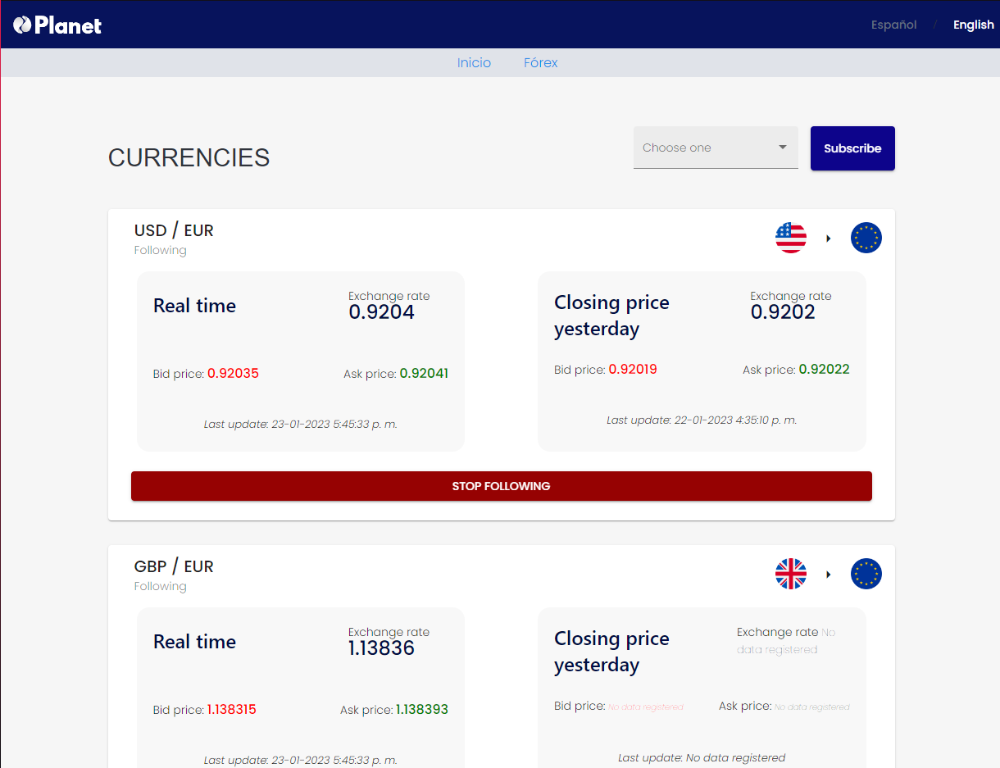
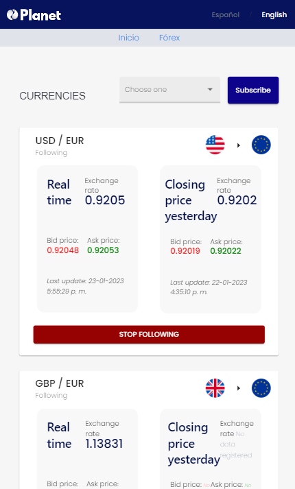
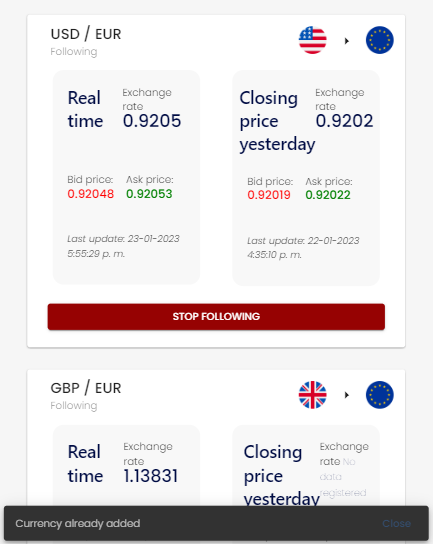

## Tasks
1. Implementing an interface to configure the user's preferences.
2. Implementing API endpoints to retrieve data.
3. Implementing asynchronous tasks.

This is the workflow that we tried to replicate in this task.

## Angular app
Find here some screenshots showing its main functionalities:
1. No subscriptions view.

  

2. Main view showing information about subscribed currencies (PC and mobile phone design).

  

  

3. Error message displayed when trying to subscribed to a currency that has already been followed.

  

